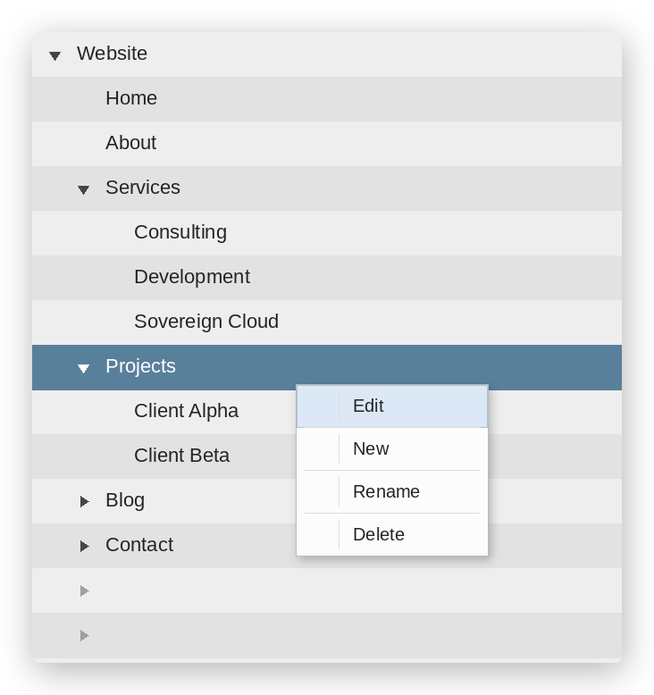

# yii2-jstree

[](https://packagist.org/packages/studio255/yii2-jstree)
[](https://packagist.org/packages/studio255/yii2-jstree)
[](LICENSE)

A Yii2 widget for the [jsTree](https://www.jstree.com/) jQuery library — display and manage Yii2 ActiveRecord models as interactive trees.



## Features

- Load tree data via AJAX
- Custom icons per node type (FontAwesome, Bootstrap Icons, or any CSS class)
- Context menu: create, rename, duplicate, delete
- Drag-and-drop reordering
- Submenu with individual node types
- Dynamic context menu — hide items per node type (e.g. no *delete* on type *page*)
- Customizable labels and confirmation messages
- Yii2 validation errors forwarded to JavaScript alerts

## Requirements

- PHP 8.2 or higher
- Yii2 2.0.51 or higher

## Installation

```bash
composer require studio255/yii2-jstree
```

## Usage

### Simple variant — JSON URL only

```php
$tree = new \studio255\jstree\JsTree([
    'jsonUrl' => '/my-json-url/data',
]);
```

```html
<div id="jstree"></div>
```

### Full variant — backed by a Yii2 ActiveRecord model

Enables create, move, rename and delete operations on the model directly from the tree.

**Required model / database fields:**

| Field       | Required | Purpose                                |
|-------------|----------|----------------------------------------|
| `name`      | yes      | Display label                          |
| `parent_id` | yes      | Tree nesting                           |
| `position`  | yes      | Sort order within parent               |
| `type`      | no       | Used for icon and permission handling  |

> **Important:** Only `name` should be a required attribute in your model — otherwise the *New* context menu action may fail.

**Controller setup:**

```php
public function actionIndex()
{
    $tree = new \studio255\jstree\JsTree([
        'modelName'             => 'backend\\models\\YourModel',
        'modelPropertyId'       => 'id',
        'modelPropertyParentId' => 'parent_id',
        'modelPropertyPosition' => 'position',
        'modelPropertyName'     => 'name',
        'modelFirstParentId'    => null,
        'modelPropertyType'     => 'type',
        'controllerId'          => 'index',
        'jstreeDiv'             => '#jstree',
        'jstreeIcons'           => false,
        'jstreePlugins'         => ['contextmenu', 'dnd'],
        'jstreeContextMenue'    => [
            'remove' => ['text' => 'Delete', 'icon' => 'fa fa-trash'],
            'edit'   => ['text' => 'Edit',   'icon' => 'fa fa-pencil'],
            'create' => [
                'text'    => 'Create new',
                'icon'    => 'fa fa-plus',
                'type'    => 'online',
                'submenu' => [
                    ['text' => 'New offline node', 'icon' => 'fa fa-cloud',      'type' => 'offline'],
                    ['text' => 'New online node',  'icon' => 'fa fa-cloud-bolt', 'type' => 'online'],
                ],
            ],
            'rename' => ['text' => 'Rename', 'icon' => 'fa fa-i-cursor'],
        ],
        'jstreeType' => [
            '#'       => ['max_children' => -1, 'max_depth' => -1, 'valid_children' => -1, 'icon' => 'fa fa-list'],
            'default' => ['icon' => 'fa fa-question'],
        ],
        'jstreeMsg' => [
            'confirmdelete' => 'Are you sure you want to delete this item?',
            'nothere'       => 'Not allowed at this position.',
        ],
    ]);

    return $this->render('index');
}
```

**View setup:**

A click on a tree item triggers the update action via AJAX and loads the result into `.jstree-result`. Forms used inside the result div should carry the class `jstree-form` so their submit response is routed back to the result container.

```html
<div id="jstree"></div>
<div class="jstree-result"></div>
```

The icon classes in the examples use FontAwesome — any CSS-based icon set works (Bootstrap Icons, Material, custom classes).

## Demo

A working demo setup is available in the [`demo/`](demo/) directory.

## License

MIT — see [LICENSE](LICENSE).